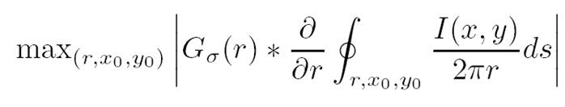
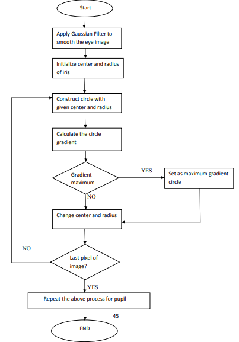

# Iris segmentation with Daughman integro-differential operator:

* I(x, y) is the intensity of the pixel at coordinates (x, y) in the image of an iris.
* r denotes the radius of various circular regions with the center coordinates at (x0, y0).

* σ is the standard deviation of the Gaussian distribution.
* Gσ(r) denotes a Gaussian filter of scale sigma (σ)
* (x0, y0) is the assumed centre coordinates of the iris.
* s is the contour of the circle given by the parameters (r, x0, y0)

# How does it work?
The operator searches for the circular path where there is maximum change in pixel values, by
varying the radius ‘r’ and the center (x, y) of the circular contour. 
A search over the entire image (of an eye) is done, pixel by pixel. At every pixel, the normalized
sum of all circumferential pixel values, at increasing radius is found. At every level of increased
radius, the difference between the normalized sums of pixel intensity values at adjacent radii circle
is noted. 

# Image enhancement techniques to improve the output:
* imfill and imcomplement (to compensate for the light reflections)
* Thresholding: Thresholding is a method of image segmentation. It is used
before implementing Daugman’s equation. ‘Thresholding below’ marks some pixels as ‘object
pixels’ if those pixels have an intensity value below a certain threshold value. This is done
assuming that the ‘object pixels (i.e. the pixels that could possibly be the centre pixels)’ to be darker
than the background pixels.

