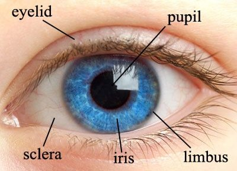

# Biometrics_project

#  Gender detection using IRIS  

## Team members:
               Esraa Sayed 
               Iriny Adel 
               Fatma Mohamed
                Ahmed Mahdy
# Problem statement:
- Gender prediction from iris recognition techniques is  widely used in human identification process which is called Biometric identification.
- As the iris of the two eyes of same individual aren’t comparative, the iris recognition gives more accurate result comparing with other biometric verifications.
so, it is considered as the most accurate biometric identification system.
- The performance of iris recognition system enhanced the gender prediction from their iris images . 
- Because of its high recognition rate, the iris recognition is one of the most meticulous biometric modality.

**iris image:**

# Work significance:
Gender information may also be useful when a person isn't recognized but is attempting to gain entry to a restricted zone. Another possible use of gender information arises in social settings, where it may be useful to screen entry to an area based on gender, while not recording the identity. Gender classification is also important for banking transactions from cellular phones, demographic information collection, marketing research, and real-time electronic marketing. It is important to note that, for enrollment, we need to search the entire database to ensure that someone is not trying to generate two identities, one male, and one female, in order to double dip. For verification, we only need to search against the target template. Therefore, the gender information may be relevant to the management of the iris datasets

# Background:
Previous works on gender-from-iris have been tried to find manually the best feature extraction methods to represent the gender information of the iris texture from normalized and encoded images, and now there is an approach of automatic pixels feature extraction for Gender Classification using Near-Infra-Red Periocular iris images with Deep learning.

Tables below show you the previous work at this project:

# Dataset:
CVBL IRIS Gender Classification Database Image Processing and Biometric Research, Computer Vision and Biometric Laboratory (CVBL)

**Metadata description:**
The (F) label indicates female gender						
The (M) label indicates male gender					

**Data base description:**

Image type: RGB Color (Super resolution)	
No. of subjects: 704
No. of images per subject: 6	
No. of images per eye: 3	
No of subjects per gender: 312 Men, 392 Women	
Dimension: 5184x3456 Pixel
Resolution: 72x72 dpi	
Format: .JPG	
Naming L: means left eye						
Naming R: means right eye	

**Camera description:**
Camera maker: Canon
Camera model: Canon EOS 550D 
F-stop: f/8
Exposure time: 1/50 sec
ISO speed: ISO-100
Flash mode: A flash ring, MEIKE MK-FC110 
Distance with subjects: 20 cm

**References:**
Saeed Aryanmehr, Mohsen Karimi, and Farsad Zamani Boroujeni. "CVBL IRIS Gender Classification Database Image Processing and Biometric Research, Computer Vision and Biometric Laboratory (CVBL)." 2018 IEEE 3rd International Conference on Image, Vision and Computing (ICIVC). IEEE, 2018.\

**Samples:**

# Techniques:
- **paper2018** aplying three experiement:
1. Bottleneck approach
  Used a pre-trained model on a large dataset as a feature extractor. For this approach, we used the VGG-16, VGG-19 and Resnet-50 architectures,
  In this experiment we extract the best features along the network and then classify gender using a small dense neural network.

2. Fine-tuning
  The fine-tuning approach refers to initializing a CNN with pre-trained parameters (weights) instead of random parameters and then perform a small update of the weights with     are training of the model but with a new dataset.

  In order to improve the results of Experiment 1, we retrained the last convolutional layers of each models using a small dense layer. In this approach, we improve the accuracy   of each model to classify gender from periocular images, adjusting the weights of those convolutional blocks from VGG and Resnet-50 that extract the most complex features of     each image.

3. Convolutional Neural Network (CNN) trained from scratch
  "Training a CNN from scratch with a small number of images using the Data Augmentation technique reached the best classification rate and automatically found the most relevant    areas for this task. We concluded that training a model from scratch even with a small number of layers, performed better than using a pre-trained powerful model such as VGG    and Resnet in this kind of problems"

- **paper2019**:
1. The input image is segmented in a pre-process step.
2. The iris region is then transformed to a polar space and codified using MBSIF. 
3. Finally, gender classification is performed using a new database and several classifiers

 			

# References:

1. https://www.researchgate.net/publication/330002730_Deep_Gender_Classification_and_Visualization_of_Near-Infra-Red_Periocular-Iris_images 

2.  https://arxiv.org/pdf/1905.00372.pdf 

3. https://www.ijert.org/research/gender-prediction-from-iris-recognition-using-artificial-neural-network-ann-IJERTV9IS070394.pdf 

4. https://arxiv.org/pdf/1905.00372.pdf 

